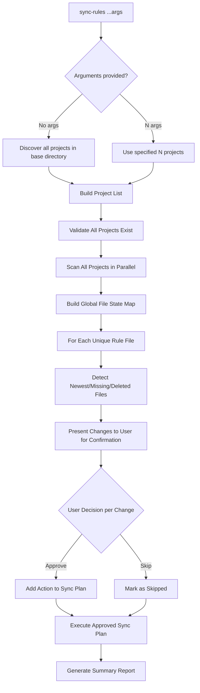

# Design: Unified Sync-Rules Architecture

## 1. Core Principles

This document outlines the architecture for a unified `sync-rules` command. The design is based on the following core principles:

1.  **Single, Unified Command:** A single `sync-rules` command handles all synchronization scenarios.
2.  **All Projects are Peers:** There is no concept of a "source" or "destination" repository. All projects are treated equally.
3.  **Newest Version Wins:** The newest version of a rule file across all participating projects is considered the source of truth for a sync operation.
4.  **Deletion Detection:** The tool actively detects when a rule file has been deleted in one project and prompts the user on how to handle it across others.
5.  **User Confirmation is Mandatory:** No file system changes are made without an explicit, interactive confirmation from the user.

## 2. CLI Interface

The CLI is designed for maximum flexibility and simplicity.

```bash
# Multi-project mode: Discovers and syncs all projects in a base directory (default: ~/Developer)
sync-rules

# Specific project mode: Syncs an arbitrary number of specified projects
sync-rules /path/to/projectA /path/to/projectB
sync-rules /path/to/projectA /path/to/projectB /path/to/projectC

# Syncing with options
sync-rules project1 project2 --dry-run
sync-rules --exclude "test-*" --auto-confirm
```

### Usage Examples

```bash
# Sync all projects found in the default base directory (~/Developer)
sync-rules

# A traditional two-project sync, but now they are treated as equals
sync-rules ~/Developer/my-app ~/Developer/my-api

# Sync three specific projects together
sync-rules ~/Developer/agent-rules ~/Developer/new-project ~/Developer/old-project

# Sync all projects within a non-default base directory
sync-rules --base-dir ~/Work
```

## 3. Architecture Flow

The synchronization process follows a consistent flow for all scenarios.



## 4. Core Data Structures

The logic is driven by a clear set of data structures representing the global state.

```typescript
// Represents the state of a single rule file across all projects
export interface FileState {
  relativePath: string;
  existsIn: Map<string, FileVersion>; // Map of projectName -> version info
  missingFrom: string[]; // List of projects where this file is missing
  newestVersion?: FileVersion;
  action: "sync" | "delete" | "conflict" | "none";
  userDecision?: UserDecision; // Captures the user's choice for this file
}

// Represents a specific version of a file in a project
export interface FileVersion {
  projectName: string;
  fileInfo: FileInfo; // Includes hash, size, etc.
  lastModified: Date;
}

// Represents the final plan after user confirmation
export interface SyncPlan {
  deletions: DeletionAction[];
  additions: AdditionAction[];
  updates: UpdateAction[];
}
```

## 5. Deletion Detection

When a file is present in some projects but missing from others, the tool will investigate to determine if it was a deliberate deletion.

### Logic:

1.  Identify a project where the file is missing.
2.  Use `git` to check the file's history in that project's repository.
3.  Command: `git log -1 --diff-filter=D -- <file_path>`
4.  If a recent deletion event is found, flag it to the user.

### User Interaction for Deletions:

```
Deletion Detected!
File '.cursorrules' exists in 'project-a' but was deleted from 'project-b' 3 days ago.

Action? [D]elete from all projects / [R]estore to project-b / [S]kip:
```

## 6. Interactive Confirmation Flow

The User Experience is centered around an interactive review of the proposed changes.

### Example UI:

```
Analyzing 4 projects... Done.

Found 3 files with changes:

1. FILE: .kilocode/rules/typescript.md
   ├─ Newest:  backend (modified 2 hours ago)
   ├─ Outdated: frontend (modified 1 day ago)
   └─ Missing: mobile-app
   ACTION: Sync newest to 2 projects? [Y/n/details]: y

2. FILE: .clinerules/no-console.yaml
   └─ Exists only in: frontend
   ACTION: Add to 3 other projects? [Y/n/details]: y

3. FILE: .cursorrules
   ├─ Exists in: agent-rules
   └─ DELETED from 'backend' 1 day ago
   ACTION: Delete from 'agent-rules'? [Y/n/details]: n

----------------------------------------
Sync Plan:
- UPDATE: 1 file in 1 project
- ADD:    2 files in 4 projects
- DELETE: 0 files

Proceed? [Y/n]: y
```
